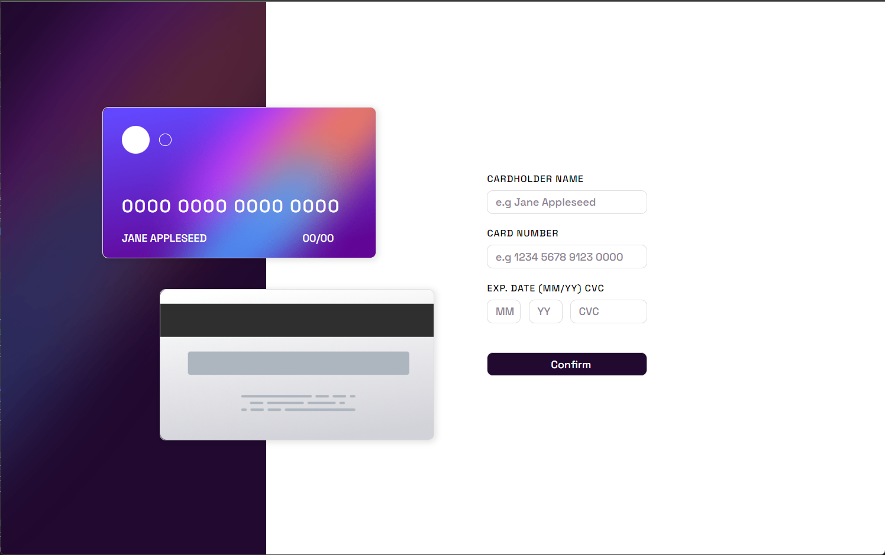

# Frontend Mentor - QR code component solution

This is a solution to the [QR code component challenge on Frontend Mentor](https://www.frontendmentor.io/challenges/qr-code-component-iux_sIO_H). Frontend Mentor challenges help you improve your coding skills by building realistic projects. 

## Table of contents

- [Overview](#overview)
  - [Screenshot](#screenshot)
  - [Links](#links)
- [My process](#my-process)
  - [Built with](#built-with)
  - [What I learned](#what-i-learned)
  - [Continued development](#continued-development)
- [Author](#author)
- [Acknowledgments](#acknowledgments)


## Overview

### Screenshot
- Desktop view


- Mobile View


### Links

- Solution URL: https://github.com/mrxshinji/Interactive-card-form
- Live Site URL: https://mrxshinji.github.io/Interactive-card-form

## My process

### Built with

- Semantic HTML5 markup
- Flexbox
- CSS Grid
- Mobile-first workflow
- React

### What I learned

- Aspect Ratio Div
1 of the Nightmare I have when doing this is to set the aspect ratio properly with vw. Until I realized I was dumb and I could just use vw as height like below;

```css
div {
        width: 45vw;
        padding-bottom: 26vw;
}
```

A lot website recommend using padding-bottom with %% but that doesnt work for me since it is not full page and my width is base on view width. So instead, I use vw for padding-bottom as well to maintain its ratio.


### Continued development

- React Form

I think my form is a mess with the error checking method I know. Gonna relearn this part and see any better way to do this.

### Useful resources

- [https://stackoverflow.com/] - Provide alot of insight on centering item.
- [https://www.w3schools.com/] - Provide alot help on syntax and how to use each method

## Author

- Website - [https://github.com/mrxshinji]
- Frontend Mentor - [@mrxshinji](https://www.frontendmentor.io/profile/mrxshinji)

## Acknowledgments

[Aspect Ratio box](https://css-tricks.com/aspect-ratio-boxes/)

